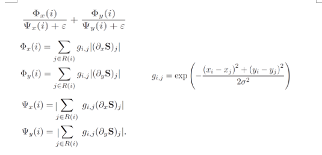

# Digital_Image_Processing
Digital Image Processing Algorithms in C++

Edge_detection

Histogram_Equalization

hough

Optimum Global Thresholding Using Otsu’s Method

RTV:

Smoothing_Spatial_Filter

Median filter

Region Growing
